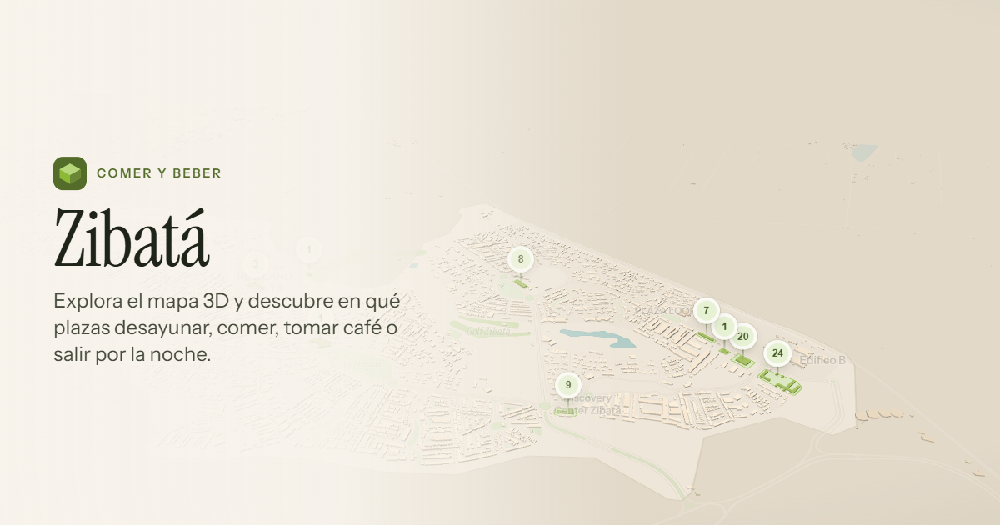

# Zibatá · Comer y beber

Guía interactiva en 3D para descubrir dónde comer y beber en **Zibatá, Querétaro**. El mapa es el
producto: se explora Zibatá, se elige una plaza y se descubren sus lugares, con búsqueda, filtros, ficha
de cada establecimiento y enlace a Google Maps para llegar.

- Sitio **100 % estático** (GitHub Pages u otro hosting): sin backend, cuentas, API keys ni servicios de pago.
- Mapa propio con **MapLibre GL JS**: edificios 3D, calles, áreas verdes y agua a partir de OpenStreetMap y
  Overture Maps: el 96 % de las vialidades dibujadas cae sobre el plano del cliente (a 11 m) y el plano
  queda cubierto al 89 % (ver [docs/MAPA.md](docs/MAPA.md)).
- **76 locales verificados en 9 plazas activas** (investigación del 2026-09-14 sobre la lista beta del cliente, con
  fuentes y confianza por registro en [research/](research/audit-report.md)); 17 categorías.
- Escritorio (panel lateral) y móvil (hoja inferior), en español y preparado para más idiomas. Diseñado
  para WCAG 2.1 AA: sin violaciones graves o críticas de axe, navegable con teclado y probado con NVDA
  (alcance y límites en [docs/ACCESIBILIDAD.md](docs/ACCESIBILIDAD.md)).



## Requisitos

- Node.js **22.18+** (recomendado 24, el de CI) y npm.
- Para los tests E2E: `npx playwright install chromium webkit`.

## Desarrollo local

```bash
npm install
npm run dev            # http://localhost:5173
```

- Modo depuración del mapa: `http://localhost:5173/?debug` (coordenadas, cámara, IDs de edificios y
  plazas, límites de teselas y superposición del plano del cliente). No existe en producción.

## Scripts

| Comando | Descripción |
| --- | --- |
| `npm run dev` | Servidor de desarrollo |
| `npm run build` | Valida datos, comprueba tipos y genera `dist/` |
| `npm run preview` | Sirve `dist/` localmente |
| `npm run check` | Lint + tipos + tests + build |
| `npm run lint` / `lint:fix` | Biome (lint y formato) |
| `npm test` | Tests unitarios y de componentes (Vitest) |
| `npm run test:e2e` | Tests E2E en escritorio, móvil, tableta y WebKit (Playwright, requiere `npm run build`) |
| `npm run perf:budget` | Comprueba el presupuesto de peso del build |
| `npm run data:validate` | Valida `data/commercial` (`-- --fix` recalcula campos derivados) |
| `npm run data:import -- <csv>` | Importa locales desde CSV |
| `npm run images:optimize` | Optimiza fotos (AVIF/WebP + miniaturas) y las registra |
| `npm run images:og` | Regenera la imagen para redes sociales (con `npm run preview` activo) |
| `npm run images:icons` | Regenera los iconos «maskable» del manifiesto |
| `npm run map:fetch` | Descarga OSM + edificios de Overture (≈15 min) |
| `npm run map:build` | Genera PMTiles, edificios de plazas, extensión y manifiesto |
| `npm run map:georef` | Georreferencia el plano del cliente |
| `npm run map:suggest-plaza -- --lat=… --lng=…` | Sugiere la geometría de una plaza |

## Estructura

```
data/
  commercial/   categories.json · plazas.json · places.json · imports/ (CSV) · schemas/
  geographic/   config.json · extent.json · manifest.json · reference/ (plano) · raw/ (no versionado)
docs/           Arquitectura, datos, mapa, pipeline GIS, pruebas, seguridad, accesibilidad,
                despliegue, contribuir, licencias y release/
public/         map/ (PMTiles + GeoJSON) · icons/ · images/ · favicon, OG, manifest
scripts/        data/ (validar, importar) · map/ (pipeline GIS) · images/
src/            app/ · components/ · config/ · data/ · features/ · hooks/ · i18n/ · lib/ · styles/ · types/
tests/e2e/      Playwright
```

Detalle en [docs/ARQUITECTURA.md](docs/ARQUITECTURA.md).

## Gestionar el contenido

Guía completa: [docs/DATOS.md](docs/DATOS.md).

- **Agregar un local:** añádelo al CSV y ejecuta `npm run data:import -- data/commercial/imports/<archivo>.csv`,
  o edítalo en `places.json` y ejecuta `npm run data:validate -- --fix`.
- **Agregar una plaza:** obtén su geometría con `npm run map:suggest-plaza`, añádela a `plazas.json`,
  ejecuta `npm run data:validate -- --fix` y `npm run map:build`.
- **Modificar una categoría:** edita `categories.json` (etiqueta, icono, orden, sinónimos). Sin tocar código.
- **Actualizar horarios:** campo `hours` (`"mon": ["08:00-22:00"]`, `[]` = cerrado) o columna `hours` del CSV
  (`lun-vie 08:00-22:00; dom cerrado`).
- **Añadir imágenes:** originales en `data/commercial/photos-src/<id-del-lugar>/` y `npm run images:optimize`.
  Solo fotos propias o con licencia: nunca de Google ni de redes sociales.
- **Google Maps:** «Cómo llegar» usa `googleMapsUri`, o las coordenadas del local/plaza (+ `googlePlaceId`
  si existe). Funciona sin ningún dato de Google.
- **Desactivar sin borrar:** `"active": false` en el local o la plaza.

## Modificar el mapa

Guía completa: [docs/PIPELINE-GIS.md](docs/PIPELINE-GIS.md).

```bash
npm run map:fetch && npm run map:build
```

- Área y contorno de Zibatá: `data/geographic/config.json` (`area.bbox`, `zibataSeedPolygon`).
- Alturas y volúmenes de plazas: `buildings` en `config.json`.
- Colores y capas: `src/features/map/style/` (`theme.ts` y `layers/`).
- Cámara inicial y límites: `src/config/map.ts`.
- Un plano de mayor resolución: reemplaza `data/geographic/reference/plano-zibata.png` y ejecuta
  `npm run map:georef`.

## Documentación

| Documento | Contenido |
| --- | --- |
| [docs/ARQUITECTURA.md](docs/ARQUITECTURA.md) | Estructura, estado, decisiones de diseño técnico |
| [docs/DATOS.md](docs/DATOS.md) | Modelo de datos y cómo editarlo |
| [docs/MAPA.md](docs/MAPA.md) | Decisiones cartográficas (alturas, volúmenes, teselas, cámara) |
| [docs/PIPELINE-GIS.md](docs/PIPELINE-GIS.md) | Cómo se generan las teselas y el manifiesto |
| [docs/PRUEBAS.md](docs/PRUEBAS.md) | Qué se prueba, con qué y qué queda fuera |
| [docs/SEGURIDAD.md](docs/SEGURIDAD.md) | CSP, privacidad, dependencias |
| [docs/ACCESIBILIDAD.md](docs/ACCESIBILIDAD.md) | Teclado, lector de pantalla, límites conocidos |
| [docs/DESPLIEGUE.md](docs/DESPLIEGUE.md) | Publicación y requisitos del hosting |
| [docs/CONTRIBUIR.md](docs/CONTRIBUIR.md) | Flujo de trabajo y convenciones |
| [docs/LICENCIAS.md](docs/LICENCIAS.md) | Licencias de datos, software, fuentes e iconos |
| [CHANGELOG.md](CHANGELOG.md) | Cambios por versión |

## Publicación (GitHub Pages)

1. Sube el repositorio a GitHub (rama `main`).
2. En **Settings → Pages**, elige **Source: GitHub Actions**.
3. Cada push a `main` ejecuta `.github/workflows/deploy.yml`: instalación → validación → lint/tipos/tests →
   build → E2E → publicación.

**La guía todavía no está publicada:** la versión 1.0.0 se etiquetó en local, sin repositorio remoto (ver
[docs/DESPLIEGUE.md](docs/DESPLIEGUE.md)).

El sitio queda en `https://<usuario>.github.io/<repositorio>/`. Con dominio propio o un repositorio
`<usuario>.github.io`, define las variables de repositorio `PAGES_BASE_PATH=/` y
`PAGES_SITE_URL=https://tu-dominio/`.

Las pull requests ejecutan `.github/workflows/ci.yml` (incluye búsqueda de secretos con Gitleaks; en cuentas
de organización Gitleaks requiere `GITLEAKS_LICENSE`). Dependabot propone actualizaciones semanales.

### Otro hosting

`npm run build` genera `dist/`, que se puede publicar en cualquier servidor estático. Si se sirve desde un
subdirectorio: `BASE_PATH=/subdirectorio/ npm run build`. El servidor debe admitir peticiones HTTP `Range`
(para PMTiles), algo habitual en Netlify, Cloudflare Pages, Vercel, S3 o nginx.

## Fuentes cartográficas y licencias

Datos © [OpenStreetMap contributors](https://www.openstreetmap.org/copyright) (ODbL) y
[Overture Maps Foundation](https://docs.overturemaps.org/attribution/). Detalle de fuentes, fechas y
licencias de datos, software, fuentes tipográficas e iconos en [docs/LICENCIAS.md](docs/LICENCIAS.md) y
`data/geographic/manifest.json`. Decisiones y hallazgos iniciales en
[docs/PROPUESTA-TECNICA.md](docs/PROPUESTA-TECNICA.md).
