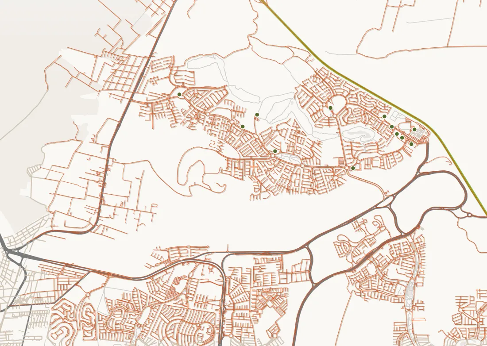

# Pipeline GIS

Cómo se producen y actualizan los datos geográficos del mapa. Todo el procesamiento ocurre **en
preparación** (tu equipo o CI), nunca en el navegador. La app solo lee los archivos resultantes.



## Resumen

```
map:fetch:osm ──┐                                   ┌─► public/map/zibata.pmtiles
                ├─► data/geographic/raw/ ─► map:build ├─► public/map/plaza-buildings.geojson
map:fetch:buildings ┘            ▲                   ├─► data/geographic/extent.json
                                 │                   └─► data/geographic/manifest.json
          data/commercial/plazas.json (geometría de plazas)
```

| Comando | Qué hace | Duración |
| --- | --- | --- |
| `npm run map:fetch:osm` | Descarga de OSM (Overpass) vialidades, usos de suelo, verdes, agua y nombres del área. Prefiere servidores con datos de ≤ 7 días. | ~10 s |
| `npm run map:fetch:buildings` | Descarga huellas de edificios de Overture Maps con DuckDB (GeoParquet público, sin credenciales). | ~15 min |
| `npm run map:build` | Procesa, genera PMTiles, GeoJSON de plazas, extensión y manifiesto. | ~1 s |
| `npm run map:georef` | Georreferencia el plano del cliente (ajuste automático contra la red vial). | ~7 s |
| `npm run map:suggest-plaza -- --lat=… --lng=…` | Sugiere la geometría de una plaza nueva. | ~2 s |

`data/geographic/raw/` no se versiona (se regenera); las salidas sí.

## Pasos del flujo (según el brief)

1. **Obtener datos.** `map:fetch:osm` y `map:fetch:buildings` con el área de `data/geographic/config.json`
   (`area.bbox`, WGS84). Cada descarga escribe un `.meta.json` con fuente, licencia, fecha de extracción y
   fecha de los datos.
2. **Georreferenciar el plano.** `map:georef` rasteriza las calles de OSM para distintas escalas y
   desplazamientos (Web Mercator, norte arriba) y elige el ajuste con más coincidencia. Resultado actual:
   3,35 m/px y **98,1 %** de coincidencia. Genera `reference/plano-zibata.webp` y `.georef.json`.
3. **Comparar con el plano.** Abre la app en desarrollo con `?debug` (`http://localhost:5173/?debug`) y usa el
   control "Plano del cliente" para superponerlo con opacidad variable.
4. **Corregir geometrías.** Las correcciones de calles o áreas se hacen en OpenStreetMap (beneficia a todos) y
   se vuelven a descargar. Las plazas se corrigen en `data/commercial/plazas.json` (ver abajo).
5. **Crear GeoJSON.** `map:build` convierte Overpass → GeoJSON (incluye ensamblado de multipolígonos) y
   clasifica cada elemento (`scripts/map/lib/classify.ts`).
6. **Simplificar.** El teselado simplifica por zoom (tolerancia 3 en extent 4096). El contorno de Zibatá se
   simplifica a ~13 m.
7. **Crear PMTiles.** Capas `boundary`, `landuse`, `water`, `waterway`, `roads`, `buildings` y `labels`, zoom
   12–16 (MapLibre sobre-escala hasta 19). Escritor propio (`scripts/map/lib/pmtiles-writer.ts`) verificado
   contra el lector oficial en los tests.
8. **Asociar edificios con plazas.** Un edificio pertenece a la plaza cuya geometría contiene su centroide.
   Si una plaza no tiene huellas (o están incompletas, `replaceExisting`), se genera un volumen a partir de
   su geometría (`buildings.plazaSynthetic` en `config.json`).
9. **Configurar alturas.** Prioridad: altura medida → niveles × 3,2 m → heurística por tipo y superficie
   (vivienda 6–7,5 m con variación determinista, comercio 8–10 m, educación 9,5–13 m).
10. **Validar.** `npm run data:validate` comprueba que las coordenadas de plazas y lugares caen dentro del área
    del mapa; los tests verifican el escritor PMTiles y la conversión OSM.
11. **Publicar.** Los archivos de `public/map/` se publican con el sitio; `manifest.json` documenta su huella
    SHA-256.

## Contorno de Zibatá

Zibatá no tiene un límite oficial en OSM. `map:build` calcula una envolvente cóncava (arista máx. 350 m) de
los vértices viales dentro de `zibataSeedPolygon`, con 70 m de margen. Si Zibatá crece, amplía el polígono
semilla (y `area.bbox` si hace falta) y vuelve a ejecutar `map:fetch` + `map:build`. La app toma la extensión
de `extent.json`, por lo que no hay que tocar código.

### Suelo planeado que aún no tiene calles

El contorno se deriva de la red vial: una zona del Master Plan todavía sin urbanizar (la expansión norte
donde irá Town Center) no aparece, aunque el plan la incluya. Para cubrirla, añade su polígono a
`boundaryExtensions` en `data/geographic/config.json` y vuelve a ejecutar `map:build`:

```json
"boundaryExtensions": [
  {
    "name": "Expansión norte (Town Center)",
    "source": "De dónde sale el polígono: plano maestro georreferenciado, plan parcial publicado…",
    "polygon": [[-100.34, 20.692], [-100.33, 20.697], [-100.32, 20.692], [-100.34, 20.692]]
  }
]
```

Cada polígono declara su procedencia y se une al contorno calculado (`turf.union`), así que el mapa cubre
esa superficie aunque esté vacía de edificios. **Sin una fuente georreferenciada no se añade**: trazar el
polígono "a ojo" sobre una imagen sería inventar el límite. El `manifest.json` registra qué ampliaciones
se aplicaron.

El contorno del Master Plan lo genera `npm run map:masterplan`, que no necesita que nadie dibuje:

```bash
npm run map:masterplan -- --source captura.png   # georreferencia, traza y escribe en config.json
npm run map:build                                # regenera el mapa con el contorno unido
```

La captura (el polígono del desarrollo en un color plano sobre un mapa) se ajusta contra las vías
principales de OpenStreetMap ya descargadas: se parte de dos anclas (`--anchor-a`, `--anchor-b`: el cruce de
la 540 con la 57D y el campus Anáhuac, en píxeles) y se busca la escala y el desplazamiento que mejor casan
las vías de OSM con las grises de la imagen. Por debajo de un 80 % de coincidencia el comando se detiene.
Después toma la mancha de color más grande, tapa rótulos e iconos con un cierre morfológico, recorre su
borde y lo simplifica a ~10 m. Sustituye cualquier entrada anterior cuyo nombre empiece por "Master Plan".
La captura no se versiona; el polígono sí, con su procedencia.

## Sistema de coordenadas

- Datos de entrada y GeoJSON: **EPSG:4326 (WGS84)**, orden `[lng, lat]`.
- Teselas vectoriales: **EPSG:3857 (Web Mercator)**.

## Añadir o corregir la geometría de una plaza

```bash
npm run map:suggest-plaza -- --lat=20.67488 --lng=-100.32261 --radius=30 --min-area=300
```

- Con huellas cercanas devuelve la envolvente convexa + margen.
- Sin huellas (`--force-rectangle`) genera un rectángulo orientado a la vialidad más cercana
  (`--length`, `--depth`, `--bearing`).

Pega el resultado en `geometry` de la plaza, revisa en `?debug` (contorno naranja) y ejecuta `npm run map:build`.
También puedes dibujar la geometría en [geojson.io](https://geojson.io).

## Actualizar todo el mapa

```bash
npm run map:fetch      # OSM + Overture (≈15 min)
npm run map:build
npm run map:georef     # solo si cambió el plano
npm run data:validate
```

Revisa el diff de `data/geographic/manifest.json` (conteos, tamaños) antes de publicar.
